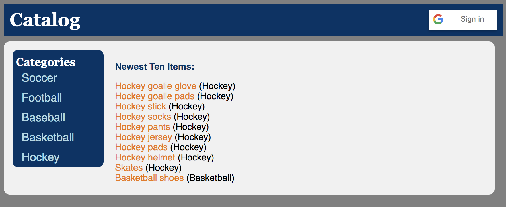
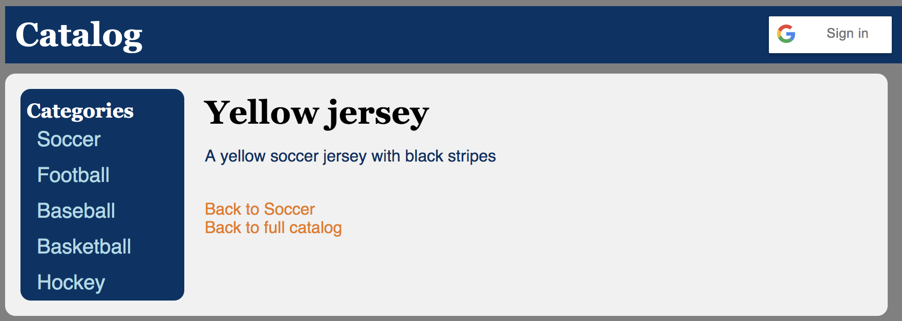

# Items Catalog Project

In this project, I create a website front-end for a sports item catalog, related API endpoints, as well as the back-end database. Combined, these allow you to view items by category in the catalog, add new items, as well as edit or delete existing items, either through the website front-end or querying the API.

- Run `database_setup.py` first to set up the database
- Run `lotsofcatalogitems.py` second to add items to the database
- Run `views.py` to be able to access the primary catalog (`localhost:8000` or `localhost:8000/catalog`) in your browser, or the related API endpoint (`localhost:8000/catalog.json` or `localhost:8000/api/catalog`).

#### Adding New Items

You must select a category on the main catalog website, and be signed in with Google, in order to add a new item.

#### Edit/Delete Items

You must have selected a specific item on the main catalog website, and be signed in with Google, in order to edit or delete an item.

### Requirements / Set-up
Install the following:

Python 3: [download here](https://www.python.org/downloads/)

Virtual Box: [download here](https://www.virtualbox.org/wiki/Download_Old_Builds_5_1)

Vagrant: [download here](https://www.vagrantup.com/downloads.html)

Once you have the above, download the [Udacity Virtual Machine](https://s3.amazonaws.com/video.udacity-data.com/topher/2018/April/5acfbfa3_fsnd-virtual-machine/fsnd-virtual-machine.zip) for the project.

Next, `cd` into where the VM was downloaded, and then cd into the `vagrant` folder within it.

You'll then run `vagrant up`, which may take awhile to install everything else necessary.
Once it has loaded, run `vagrant ssh` to enter the VM.

Once in the VM, `cd /vagrant` to enter the shared directory with your own computer.

## Example screenshots

Below are some example screenshots from the item catalog.

**Catalog Front Page**

**Category Page, no authentication**

**Category Page, with authentication**

**An item page, with authentication**

**An item page, no authentication**

**Edit item page, with authentication required**

**Delete item page, with authentication required**

**Create new item page, with authentication required**

**Updated category page for new item**

**Updated catalog page for new item**

**Item page for the new item**

